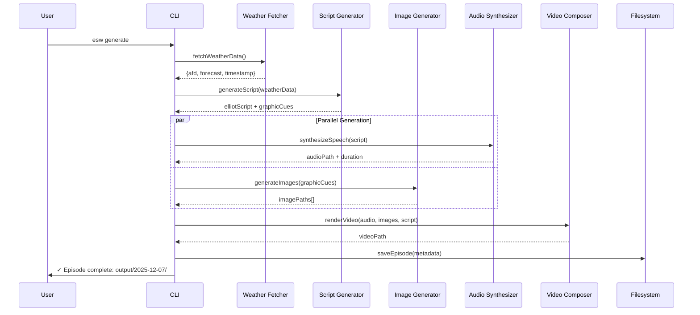

# Elliot Skyfall Daily Weather - Architecture

**Version:** 1.0.0
**Last Updated:** 2025-12-07
**Status:** Peer Reviewed (Gemini + Codex) - Ready for Implementation

---

## Overview

A simplified video weather show system that generates daily Denver weather broadcasts featuring Elliot Skyfall, an Art Bell-inspired late-night weather broadcaster. Built as a streamlined adaptation of the [AI Talk Show CLI](../ai-talkshow-cli/) architecture.

### Key Simplifications vs AI Talk Show CLI

| Aspect | AI Talk Show CLI | Elliot Skyfall |
|--------|------------------|----------------|
| AI Models | 3 (Claude, GPT, Gemini) | 1 (Claude) |
| Voices | Multiple characters | Single voice (Elliot) |
| Content Source | Multi-turn AI conversation | Weather data + single script generation |
| Segments | Spoken + Thought | Spoken only |
| Database | SQLite with complex schema | Minimal SQLite (episode tracking) |
| Duration | 30-60 min conversations | 2-4 min broadcasts |

---

## System Architecture

```
┌─────────────────────────────────────────────────────────────────┐
│                     CLI Interface (Commander.js)                 │
├─────────────────────────────────────────────────────────────────┤
│              Episode Orchestrator (State Machine)                │
│   States: init → fetch → script → media → sync → compose → done │
├──────────────────┬──────────────────┬───────────────────────────┤
│  Weather Fetcher │  Script Generator │  Media Pipeline           │
│  + Retry/Fallback│  + Graphic Cues   │  + Timeline Sync          │
├──────────────────┴──────────────────┴───────────────────────────┤
│              Storage (SQLite + Image Cache + Filesystem)         │
└─────────────────────────────────────────────────────────────────┘
```

### State Machine (Peer Review Recommendation)

```typescript
type EpisodeState =
  | 'init'           // Created, not started
  | 'fetching'       // Fetching weather data
  | 'generating'     // Generating script
  | 'synthesizing'   // Audio + Image generation (parallel)
  | 'syncing'        // Timeline reconciliation (post-TTS)
  | 'composing'      // Remotion video render
  | 'done'           // Complete
  | 'error';         // Failed (can resume from last successful state)
```

**Key benefit:** Pipeline resumes from last successful state on restart, avoiding costly re-runs of API calls.

### Component Responsibilities

| Component | Source | Responsibility |
|-----------|--------|----------------|
| **CLI Interface** | New | Command parsing, progress display |
| **Episode Orchestrator** | New | Coordinates full generation pipeline |
| **Weather Fetcher** | New | Fetch/parse NWS AFD + digital forecast |
| **Script Generator** | New | Claude API for Elliot Skyfall script |
| **Audio Synthesizer** | Adapt from Talk Show | ElevenLabs TTS |
| **Image Generator** | New | Gemini/DALL-E for visuals |
| **Video Composer** | Adapt from Talk Show | Remotion rendering |
| **Storage** | Simplified | Episode tracking, output files |

---

## Data Flow



---

## File Structure

```
elliot-skyfall-weather/
├── src/
│   ├── cli/
│   │   ├── index.ts              # CLI entry point
│   │   └── commands/
│   │       ├── generate.ts       # Main generate command
│   │       ├── preview.ts        # Preview script without rendering
│   │       └── list.ts           # List past episodes
│   │
│   ├── weather/
│   │   ├── fetcher.ts            # NWS API fetching
│   │   ├── afd-parser.ts         # AFD text parsing
│   │   ├── forecast-parser.ts    # Digital forecast parsing
│   │   └── types.ts              # Weather data types
│   │
│   ├── script/
│   │   ├── generator.ts          # Claude script generation
│   │   ├── prompt-builder.ts     # Builds Elliot prompt
│   │   └── graphic-cue-parser.ts # Extract [GRAPHIC:] cues
│   │
│   ├── audio/
│   │   ├── synthesizer.ts        # ElevenLabs integration
│   │   └── voice-config.ts       # Elliot voice settings
│   │
│   ├── images/
│   │   ├── generator.ts          # Image generation orchestrator
│   │   ├── weather-graphics.ts   # Weather visualization images
│   │   └── atmospheric.ts        # Mood/atmospheric images
│   │
│   ├── video/
│   │   ├── renderer.ts           # Remotion video rendering
│   │   ├── timeline-builder.ts   # Sequence images with audio
│   │   └── remotion/
│   │       ├── WeatherBroadcast.tsx  # Main composition
│   │       ├── GraphicOverlay.tsx    # Weather graphics layer
│   │       └── Captions.tsx          # Subtitle component
│   │
│   ├── storage/
│   │   ├── db.ts                 # SQLite connection
│   │   ├── schema.ts             # Episode schema
│   │   └── episode-store.ts      # Episode CRUD
│   │
│   └── utils/
│       ├── config.ts             # Environment config
│       ├── date-utils.ts         # Date/time helpers
│       └── ffprobe.ts            # Audio duration measurement
│
├── output/                       # Generated episodes (gitignored)
│   └── {YYYY-MM-DD}/
│       ├── video.mp4
│       ├── audio.mp3
│       ├── script.md
│       ├── metadata.json
│       └── images/
│
├── .env.example
├── package.json
├── tsconfig.json
├── ELLIOT_SKYFALL_PROMPT.md     # Character & prompt reference
├── ARCHITECTURE.md               # This file
└── README.md
```

**File Count:** ~25 core implementation files (vs 48 in Talk Show CLI)

---

## CLI Commands

```bash
# Generate today's episode
esw generate

# Generate for specific date (replay/backfill)
esw generate --date 2025-12-06

# Preview script only (no audio/video)
esw generate --preview

# Skip image generation (faster)
esw generate --no-images

# List recent episodes
esw list

# Show episode details
esw show 2025-12-07
```

---

## Database Schema

Minimal SQLite schema for episode tracking:

```sql
CREATE TABLE episodes (
  id TEXT PRIMARY KEY,
  broadcast_date TEXT NOT NULL UNIQUE,
  broadcast_time TEXT NOT NULL,
  episode_number INTEGER NOT NULL,
  weather_data_timestamp TEXT,
  script TEXT,
  audio_path TEXT,
  video_path TEXT,
  duration_secs REAL,
  status TEXT DEFAULT 'pending',
  created_at TEXT DEFAULT CURRENT_TIMESTAMP,
  error TEXT
);

CREATE TABLE weather_snapshots (
  id TEXT PRIMARY KEY,
  episode_id TEXT REFERENCES episodes(id),
  afd_raw TEXT,
  forecast_raw TEXT,
  parsed_data TEXT,
  fetched_at TEXT
);
```

---

## Integration Points

### Weather Data (NWS)

```typescript
interface WeatherData {
  afd: {
    keyMessages: string[];
    discussion: string;
    hazards: Hazard[];
    issueTime: string;
  };
  forecast: {
    hourly: HourlyForecast[];
    current: CurrentConditions;
  };
  fetchedAt: string;
}
```

### Script Generation (Claude)

```typescript
interface ScriptGenerationRequest {
  weatherData: WeatherData;
  broadcastDate: string;
  broadcastTime: string;
  episodeNumber: number;
}

interface ScriptGenerationResult {
  script: string;           // Full broadcast text
  graphicCues: GraphicCue[]; // [GRAPHIC: ...] markers
  estimatedDuration: number; // Seconds
}
```

### Audio Synthesis (ElevenLabs)

Reuse from AI Talk Show CLI:
- `ElevenLabsService` with character timestamps
- `AudioNormalizer` for format consistency
- Voice ID for Elliot's baritone

### Image Generation

```typescript
interface ImageGenerationRequest {
  type: 'atmospheric' | 'weather_graphic' | 'character';
  prompt: string;
  weatherContext?: WeatherData;
}

// Image types:
// 1. Atmospheric: Night sky, Denver skyline, moody backgrounds
// 2. Weather Graphics: Temperature maps, wind visualizations, radar-style
// 3. Character: Elliot Skyfall portrait (generated once, cached)
```

### Video Composition (Remotion)

Adapt from AI Talk Show CLI:
- Simpler timeline (no multi-speaker switching)
- Weather graphic overlays at cue points
- Scrolling captions synced to audio
- Atmospheric background with Elliot

---

## Configuration

```env
# Episode Settings
BROADCAST_TIME=22:00           # Default broadcast time (10 PM MST)
TARGET_DURATION_SECS=180       # 3 minute target

# Claude
ANTHROPIC_API_KEY=sk-ant-xxx
CLAUDE_MODEL=claude-sonnet-4-20250514

# ElevenLabs
ELEVENLABS_API_KEY=xxx
ELLIOT_VOICE_ID=xxx            # Baritone male voice

# Image Generation
IMAGE_PROVIDER=gemini          # or 'openai'
GEMINI_API_KEY=xxx
OPENAI_API_KEY=xxx             # If using DALL-E

# Paths
OUTPUT_DIR=./output
DATABASE_PATH=./data/elliot.db
```

---

## Borrowed from AI Talk Show CLI

### Direct Reuse (Copy & Adapt)
- `src/audio/elevenlabs-service.ts` → Audio synthesis
- `src/audio/audio-normalizer.ts` → Format normalization
- `src/audio/sentence-timing-calculator.ts` → Caption timing
- `src/utils/ffprobe.ts` → Duration measurement
- `src/utils/prerequisite-validator.ts` → Check ffmpeg, API keys
- Remotion bundling patterns

### Patterns to Follow
- Database-backed state for resume-on-failure
- Circuit breaker on API failures
- Progress indicators with ora
- Character-level timestamps for captions
- Timeline calculation from audio duration

### Not Needed
- Multi-AI orchestration
- Conversation context management
- Speaker selection
- Job queue (single sequential pipeline)
- Thought/whispered segments
- Multiple voice configurations

---

## Implementation Phases

### Phase 1: Foundation (Day 1)
- [ ] Project setup (package.json, tsconfig)
- [ ] Database schema and migrations
- [ ] Config loader
- [ ] CLI scaffolding

### Phase 2: Weather Integration (Day 1-2)
- [ ] NWS AFD fetcher
- [ ] Digital forecast fetcher
- [ ] Weather data parsers
- [ ] Weather type definitions

### Phase 3: Script Generation (Day 2)
- [ ] Claude integration
- [ ] Prompt builder with character context
- [ ] Graphic cue parser

### Phase 4: Audio Pipeline (Day 2-3)
- [ ] Port ElevenLabs service
- [ ] Voice configuration for Elliot
- [ ] Audio synthesis workflow

### Phase 5: Image Generation (Day 3)
- [ ] Image generator abstraction
- [ ] Weather graphic prompts
- [ ] Atmospheric image prompts

### Phase 6: Video Composition (Day 3-4)
- [ ] Port Remotion patterns
- [ ] WeatherBroadcast composition
- [ ] Timeline with graphic overlays
- [ ] Caption synchronization

### Phase 7: CLI & Polish (Day 4)
- [ ] Generate command
- [ ] Preview command
- [ ] List command
- [ ] Progress indicators
- [ ] Error handling

---

## Peer Review Insights (Gemini + Codex)

### Questions Answered

1. **Is parallel audio/image correct?**
   - **Yes** - both reviewers confirm this is the right optimization
   - Add sync validation pass before final assembly

2. **Should images be cached?**
   - **Yes** - cache character portrait, lower-thirds, weather templates
   - Use cache key: `hash(prompt + model + style_version)`
   - Prevents style drift and reduces latency/cost

3. **Is SQLite appropriate?**
   - **Yes** - perfect for single-writer, daily-batch process
   - Add migration story and vacuum/backup cadence

4. **NWS API failure handling?**
   - Retry with exponential backoff (3 attempts)
   - Fallback to previous day's cached forecast
   - Script must acknowledge stale data when using fallback

5. **Weather graphic timing alignment?**
   - Core technical challenge identified by both
   - Solution: Parse TTS word timestamps, map cues to sentence boundaries
   - Enhanced cue format: `[GRAPHIC: desc | DURATION: 5s]`

### Key Recommendations Incorporated

- **State Machine Orchestrator** - Resumable pipeline
- **Post-TTS Timeline Reconciliation** - Sync graphics to audio
- **Structured Logging** - Per-step debugging
- **Style Versioning** - Lock prompts/seeds for consistency
- **Fail Fast with Placeholder** - If graphic cue fails, use slate

---

## Next Steps

1. **Begin Phase 1** - Initialize project structure
2. **Test NWS endpoints** - Verify data availability
3. **Explore ElevenLabs voices** - Find Elliot's voice
4. **Generate test images** - Establish visual style

See `IMPLEMENTATION_PLAN.md` for detailed phase breakdown.
